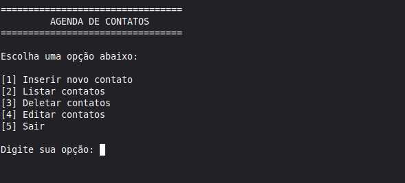

# Agenda De Contato Com Python (projeto de estudo)
Agenda de contatos em python, funcionando 100% no terminal.

## Funções:
- Adicinar contato
- Listar contatos
- Editar contatos
- Deletar contatos
- Salvar contatos no sistema

## Sistema

